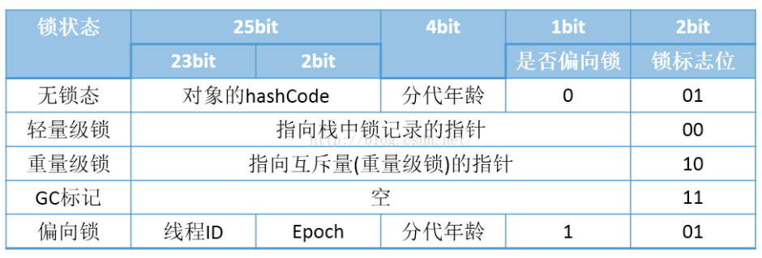

#java多线程编程相关
————————————————————————————————————————

###1、synchronized 和 ReentrantLock 有什么区别？有人说 synchronized 最慢，这话靠谱吗？

* synchronized是java内置的同步机制，提供互斥语义和可见性。互斥的，独占的，可重入的，高版本进行了优化，性能也不再是太差，非公平锁。
* ReentrantLock是可重入的锁，可以支持公平和非公平锁模式，公平锁是按照先来后到，非公平是可以抢占的，容易造成饥饿，有的线程始终拿不到锁。
* 公平锁和非公平锁
* 可重入锁和不可重入锁
* 共享锁和独享锁
* 偏向锁、重量级锁、轻量级锁（三种锁状态）
* 乐观锁和悲观锁
* 分段锁
* 自旋锁

###2、synchronized底层怎么实现的？
* monitorenter/monitorexit通过一对指令级别实现的，管程实现
* 偏向锁，轻量级锁，重量级锁。
* 升级、降级等是jvm的优化synchronized的机制，如果没有竞争，同步使用偏向锁，当出现竞争的时候，从偏向锁状态跳出，到轻量级锁，通过cas，操作markword来尝试获取锁。如果没成功就升级成重量级锁。
* 偏向锁是操作对象头的MarkWord部分设置线程id，设置偏向锁状态
* 对象头格式如图所示：


* 锁状态发生变化的时候会相应修改对象头的信息


###3、java线程生命周期
* 重复调用线程的start方法会抛出线程状态非法的异常
* NEW，线程被创建但是还没启动
* RUNNABLE，线程已经被启动，等待cpu的时间片
* BLOCKED，阻塞状态
* WAITING，等待其他线程操作
* TIME_WAITED，计时等待
* TERMINATED，终止状态


* ThreadLocal可能会造成内存泄漏

###4、死锁
* 循环依赖等待三种情况：
* 循环依赖
* 资源长期持有
* 资源独占
死锁代码：

``` java

public class A extends Thread{
	private String a;
	private String b;
	
	public A(String a, String b){
		a=a;
		b=b;
	}
	public void run(){
		synchronized(a){
			try{
				Thread.sleep(1000);
				synchronized(b){
					
				}
			}catche(InterruptedException e){
			
		}
	}
}

public class test{
	public static void main(String[] args){
		String a="A";
		String b="B";
		Thread a=new A(a,b);
		Thraad b=new A(b,a);
		a.start();
		b.start();
		a.join();
		b.join();
	}
}

```
* 为什么死锁，关键在于构造锁的时候传入的两个参数，线程ab在run的时候分别拿到ab的锁

###5、java并发工具包
* CountDownLatch，提供栅栏操作，所有线程等待一起触发，允许一个或多个线程等待某些操作完成，例如等待所有线程都完成特定逻辑，不可重置
* CycleBarrier，循环，允许多个线程到达某个屏障，减法计数，但是计数为0后会重置为初始化大小
* Semaphore，许可，可以允许多线程同时启动任务，信号量实现
* ConcurrentHashMap，线程安全的hashMap，内部以前用的分段锁，后面进行优化，利用cas，valatile等
* CopyOnWriteArrayList，写时拷贝，利用类似快照技术实现线程安全
* LinkedBlockingQueue，ArrayBlockingQueue，SynchronousQueue， PriorityBlockingQueue等
* ConcurrentLinkedQueue，非阻塞的线程安全队列
* Executor框架创建各种合适的线程池
* ConcurrentLinkedQueue，并发容器，线程安全的，LinkedBlockingQueue内部实现基于锁，会发生阻塞

###6、java线程池
* newCachedThreadPool，缓存线程池
* newFixedThreadPool，固定线程数的线程池，工作队列是无界的，容易造成oom
* newSingleThreadExecutor，单线程的线程池
* newScheduledThreadPool，固定时间或固定延迟的线程池
* newWorkStealingPool，java8以后新添加的，表示可以并行处理任务，不保证任务处理的顺序
* ThreadPoolExecutor
* 避免在线程池中使用ThreadLocal，容易造成内存泄漏问题，因为Map不会被回收，里面map的东西会越来越多

###7、原子类的实现Automatic
* 底层实现时cas实现，其实是compare and swap。利用cas命令进行更新，cas是无锁的