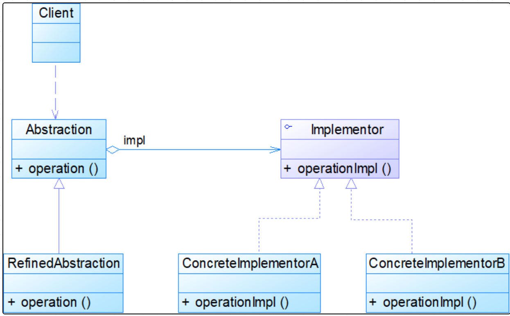

## Effective Java读书笔记

### 1、使用静态工厂方法代替构造器
* 使用场景
	* 在类中通过类的静态方法构建一个工厂方法，改方法返回值就是一个类实例
	* 例如： 

```java
	public static Boolean valueOf(bool b){
		return b ? Boolean.TRUE : Boolean.FALSE;
	}
```

* 为什么要这么做呢？
	* 静态工厂的方法名可以自定义，那么在使用的时候就赋予了他业务的含义，让使用方使用起来简洁明了。
	* 静态工厂方法可以重用已经生成的类实例，因为如果每次都新建的话是比较消耗性能的。
		* ？类实例的创建过程？
		
			> 加载->验证->准备->解析->初始化
			
		* 典型的Integer里面就是有缓存，缓存的是-128到127的对象，其初始化时是通过静态代码块，在类实例没创建的时候就构造出来了
		* 超出这个范围的就重新新建，同时也不缓存
	* 静态工厂方法可以返回原返回类型的任何子类型的对象？？
		* 如何去理解呢？

	* 静态工厂方法所返回的实例对象可以随着每次调用而发生变化，这取决于静态工厂方法的参数
		* 通过方法参数控制不同返回对象

	* 静态工厂方法返回的对象所属的类，在编写该静态工厂方法时可以不存在
		* 这种灵活的方法构成了服务提供者框架
		* 服务提供者框架是多个服务提供者实现一个服务，系统为服务提供者的客户端提供多个实现，并把他们从多个实现中解耦出来。其包含三个重要组件：服务接口，提供者注册API，服务访问API
			* 服务接口：是有服务提供者实现的
			* 提供者注册API：服务提供者用来注册服务实现的
			* 服务访问API：是客户端用来指定某种选择实现的条件
		
* 设计模式-->桥接模式<br>
桥接模式将抽象部分和它的实现部分分离，使他们都可以独立地变化。<br>
模式结构如下图所示：




说明：

	（1）抽象和具体的实现之间通过聚合的方式获得关联;
	（2）Abstraction为抽象化角色，定义出该角色的行为，同时保存一个对实现化角色的引用；
	（3）Implemetor是实现化角色，他是接口或者抽象类，定义角色必须的行为和属性
	（4）RefinedAbstraction是修正抽象化角色，引用实现化角色对抽象化角色进行修正
	（5）ConcreteImplementor是具体实现化角色，实现接口或者抽象类定义的方法或属性

``` java
//以手机品牌和手机软件为例子，手机有不同品牌，每种手机都会有不同的软件
//interface
public interface SoftWare{
	public void run();
} 
//不同软件的实现
public Game implements SoftWare{
	public void run(){
		System.out.println("Play games..");
	}
}
public Calendar implements SoftWare{
	public void run(){
		System.out.println("Calendar")
	}
}
//abstraction
public abstract phoneBrand{
	private SoftWare sw;
	
	public void setSoftWare(SoftWare sw){
		this.sw=sw;
	}
	
	//依赖具体实现，不同品牌手机有不同的运行方式
	public abstract void run();
}
//
public Huawei extends phoneBrand{
	pulic void run(){
		sw.run();
	}
}
//不同的实现有不同的运行方式，但是对于相同的软件，运行方式都相同
public Vivo extends phoneBrand{
	public void run(){
		System.out.println("Hello vivo!");
		sw.run();
	}
}

//调用
public class Zhiyi{
	public static void main(String[] args){
		phoneBrand pb=new Huawe();
		pb.setSoftWare(new Game());
		pb.run();
		pb.setSoftWare(new Calendar());
		pb.run();
	}
}
```


### 2、多个构造器参数的时候考虑使用构建器
* 使用建造者模式，在多个构造器参数的方法中通过flow模式构建对象
* 通过这种方式可以自由组合构造器中的参数传递问题，如果不采用建造者模式，那么就需要很多的不同参数组合的构造函数。

``` java
public class ClassRoom{
	private String table;
	private String chair;
	private String students;
	private String teacher;
	
	public static class ClassRoomBuilder{
		private String table;
		private String chair;
		private String students;
		private String teacher;
		
		public classRoomBuilder(){
		}
		public classRoomBuilder table(String table){
			this.table=table;
			return this;
		}
		public classRoomBuilder chair(String chair){
			this.chair=chair;
			return this;
		}
		public classRoomBuilder students(String students){
			this.students=students;
			return this;
		}
		public classRoomBuilder teacher(String teacher){
			this.teacher=teacher;
			rerturn this;
		}
		public classRoom build(){
			return new classRoom(this);
		}
	}
	
	private ClassRoom(ClassRoomBuilder builder){
		this.table=builder.table;
		this.chair=builder.chair;
		this.students=builder.students;
		this.teacher=builder.teacher;
	}
}
```

### 3、私有构造器的使用
* 通过私有构造器让类无法被外部实例化
* 单例模式下的类构造器使用私有构造，可以保证不会被外部实例化
* 静态工具类和单例模式不适合需要引用底层资源的类，资源使用时使用try-with-resources的方式

```java
    //1、这里需要注意，内部的resources必须实现或者扩展了AutoCloseable接口，单资源
public class test{
    public void test1(){
        try(BufferedReader bf=new BufferedReader(new FileReader(path))){
        }
    }

    //2、多资源
    public void test2(){
        try(BufferedReader bf=new BufferedReader(new FileReader(path));
		        OutputStream out=new FileOutputStream(src)){
        }
    }
}
```
***单例设计模式***<br>
（1）懒汉模式，在类实例需要的时候才创建。分为线程安全和线程不安全的写法

```java
//thread safe
public class Singleton{
	private Singleton instance;
	private Singleton(){
	}
	public Singleton getInstance(){
		if(instance==null){
			instance=new Singleton();
		}
		return instance;
	}
}
//thread no safe
public class Singleton{
	private Singleton instance;
	private Singleton(){
	}
	public synchronized getInstance(){
		if(instance==null){
			instance=new Singleton();
		}
		return instance;
	}
}
```
（2）饿汉模式，初始化的时候就已经创建好了

```java
//静态成员变量在准备阶段就会创建
public class Singleton{
	private static Singleton instance=new Singleton();
	private Singleton(){
	}
	public static Singleton getInstance(){
		return instance;
	}
}
```
（3）双检索，线程安全模式

```java
public class Singleton{
	private Singleton instance;
	private Singleton(){
	}
	public Singleton getInstance(){
		if(instance==null){
			synchronized(Singleton.this){
				if(instance==null){
					instance=new Singleton();
				}
			}
		}
		return instance;
	}
}
```
（4）静态内部类
（5）枚举

```java
public enum Singleton{
	INSTANCE;
	
	public static Singleton get(){
		return INSTANCE;
	}
}
```

### 4、不要使用finalize方法
* finalize方法的执行时间不确定，不知道什么时候执行，会造成很大的性能损失
* finalize阻止了正常的垃圾回收，将垃圾回收时间拖长，因为垃圾回收的时候会把重写了finalize的对象放到一个finalize的回收队列，尝试执行自定义的finalize方法，这个执行的契机是不确定的
* 如果类对象中封装了资源，那么就要使用try-with-resources方式，具体实现时要让类实现AutoCloseable接口，实现close方法，在具体的实现方法中去关闭资源try()的括号中写类实例，这样在执行完try语句以后会自动的调用close方法。

### 5、所有对象通用的方法
（1）覆盖equals方法

* 需要满足自反性
* 对称性
* 传递性

（2）覆盖equals方法的同时必须覆盖hashcode方法，否则该类无法结合所有基于散列的集合

* 覆盖equals必须覆盖hashcode
* 相等的对象必须有相同的hashcode值

（3）覆盖toString方法

* 使用好的tostring方法可以让类使用起来更加的方便
* 无论是否指定格式，在tostring方法中都应该表明你自己的意图

（4）谨慎覆盖clone方法

* cloneable方法表明这样的对象是允许克隆的
* 注意克隆应该是逐域克隆的
* 不可变的类不要提供clone方法
* 对象拷贝的最好方法应该是提供一个拷贝构造器或者拷贝工厂，类似如下实现

```java
//拷贝构造器
public Yum(Yum yum){
	...
}
//拷贝工厂
public static Yum newInstance(Yum yum){
	...
}
```

（5）Comparable接口

* 实现comaprable接口的可以跟一些泛型算法或者相应集合协作开发
* 多域比较应该按照自定义的重要程度逐域比较

### 6、类和接口
（1）如果想让一个类是不可变的，就需要保证
	
* 不要提供任何会修改对象状态的方法
* 要保证类不被扩展
* 
