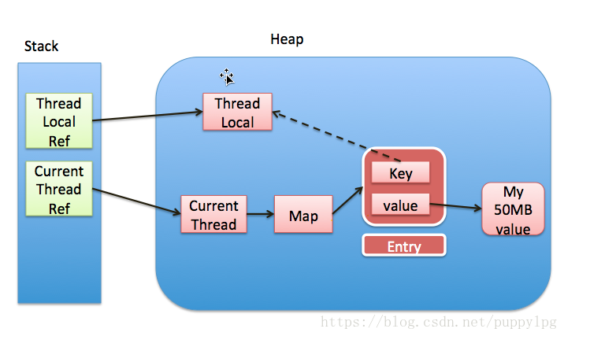

##java笔记
————————————————————————————————————————————————————————————————
###1、NoClassDefFoundError和ClassNotFoundException区别
* NoClassDefFoundError表示java虚拟机或者类加载器尝试去加载一个类定义，但是没找到
* ClassNotFoundException表示应用尝试通过名字加载类的时候加载不到

###2、final、finally、 finalize 有什么不同？
（1）	final修饰变量和类，表示其不可变，当修饰的是引用的时候表示引用不可变，引用的值可变

* final不是不可变的，
* final修饰的类不可以被继承
* final修饰的方法不可以被重写

（2）	finaly是try{}catche{}finally{}的最后的方法，表示无论是否catch到异常，其内部的代码逻辑都会被执行

* System.exit() System.exit()的作用是中止当前虚拟机,虚拟机都被中止了,finally代码块自然不会执行

（3）	finalize是一个object类的方法，保证实例回收前执行必要的资源回收工作

* finalize是和垃圾回收关联的，对象在垃圾回收前会执行，但是这个是不可预测的，不确定什么时候执行这个finalize方法

###3、强引用、软引用、弱引用、幻象引用有什么区别？具体使用场景是什么？
（1）	强引用，只有在不在被使用的时候才会被垃圾回收，我们普通使用的new对象的引用
（2）	软引用，只有在垃圾回收后内存仍然不满足的时候才会被回收，报内存不够时会保证提前把他回收
（3）	弱引用，在下一次垃圾回收后，该引用的对象就会被回收
（4）	虚引用，gc是不会

	ThreadLocal的内存模型，其引发的内存泄漏的问题。
	线程的TreadLocal存在堆中，由Tread的堆中的引用维护，
	一个map，Key对应的线程的ThreadLocal，value是对应的值。
	当时Tread的引用中的key对ThreadLocal的引用时弱引用，
	在下一次gc的时候就会回。这样就造成map的key被垃圾回收了，
	但是Thread对该map的引用有事强引用，这样就造成map中的数据堆积，
	容易造成oom。

	
####4、理解 Java 的字符串，String、StringBuffer、StringBuilder 有什么区别？
* String, 是java构造和管理字符串的基本逻辑，是不可变的类，字符串拼接剪切等操作会产生新的String对象，太多可能会造成oom。
* StringBuffer,为了解决太多字符串拼接造成的方法区的运行时常量区被塞满而构建的，他是类，可以通过调用append等方法完成字符串的拼接工作。
* StringBuilder,为了解决太多字符串拼接造成的方法区的运行时常量区被塞满而构建的，他是类，可以通过调用append等方法完成字符串的拼接工作。 
* StringBuffer和StringBuilder都可以完成字符串修改工作，区别在于StringBuilder不是线程安全的，不能被同步访问到。但是StringBuilder相对StringBuffer速度更快。如果要求线程安全就必须用StringBuffer了。
* String.intern()方法提示jvm将字符串缓存起来，已备重复使用，如果有缓存的字符串就用缓存的字符串，没有的话就创建一个并且将它缓存起来。jdk8中，该缓存被放到堆里面，可以被垃圾回收。

####5、谈谈 Java 反射机制，动态代理是基于什么原理？
* 反射是java提供的语言基础，通过反射可以在运行过程中动态创建类实例，可以通过反射去操作类，获取类的方法，属性等信息，可以调用类的构造方法。
* 动态代理，方便运行时构建代理、动态处理代理方法等，比如rpc，aop等。动态代理是一种代理机制，通过代理可以将调用者和实现者之间实现解耦合。

####6、int和Integer有什么区别，Integer的值缓存
int是基本类型，Integer是int的包装类，提供了基本的方法。java5中有自动装箱和拆箱机制，Integer会有值缓存，因为在使用中会发现一般integer会在较小的值范围内，所以对小值范围的Integer进行缓存可以提高下次Integer的创建速度。

####7、对比 Vector、ArrayList、LinkedList 有何区别？
	三个都是java中的list的实现，实现了AbstractList抽象类
* vector是早期的线程安全的有序集合，线程安全的动态数组实现，扩容增加一倍，内部元素顺序存储
* ArrayList线程不安全的数组实现，扩容增加50%，内部元素顺序存储，具有较好的随机访问性能。
* LinkedList是双向链表，线程不安全
* CopyOnWriteArrayList是线程安全的list，是写时复制，适合读多写少的场景

####8、对比 Hashtable、HashMap、TreeMap 有什么不同
* HashTable是早期的map实现是线程安全的，由于在方法中使用了同步，性能不是特别好
* HashMap是线程不安全的Map，但是他使用最广泛，支持null键值。
	HashMap的[死锁问题](https://www.cnblogs.com/wang-meng/p/7582532.html)
	ConcurrentHashMap线程安全的
* TreeMap是红黑树实现的顺序访问的Map，get，put，remove都是在log(n)的时间复杂度上完成的，顺序可以有传入的comparator实现。

####9、java中的集合整理 （1）java中map Map的整体类继承关系如下

* HashTable是早期集合，是线程安全的
* HashMap是线程不安全的Map，HashMap的有效性依赖hashcode的有效性，因此要注意：
	* equals相等那hashcode也必须相同
	* 重写了hashcode也要重新equals
	* hashcode必须保持一致
	* equals必须满足堆成、反射、传递等特性
* LinkedHashMap和TreeMap都是可以保证顺序性，但是LinkedHashMap是提供了插入顺序的遍历顺序，treeMap的顺序性是有key的的顺序决定，可以通过传入comparator改变。
* java标准类库提供的PriorityQueue，treeMap和treeSet等都是依赖统一中排序机制，是基于二叉堆实现的

（2）HashMap的源码分析

* HashMap内部是有数据和链表组成的复合结构，链表大小超过8以后就会树化，构成红黑树，当小于阈值的时候会退化成链表
* HashMap的容量是Lazy_load的
* table的扩容的阈值是（负载因子）✖️（容量），如果构建的时候没有指定，那就是采用默认的情况
* 门限通常以倍数进行扩容

（3）ConcurrentHashMap

* ConcurrentHashMap是线程安全的
* HashMap本身可能出现死锁的情况，resize的时候如果并发执行可能会在冲突的hash上出现环
* 线程安全是基于分离锁，在内部进行分段，采用分段锁防止出现整个数组被锁住的情况。里面是HashEntry的数组
* 内部采用volatile实现value字段的可见性，可以参考下图

可以看出内部使用分段锁来实现
> Java8之后发生了什么变化呢
* 内部仍有segment，但是只是为了保证序列化的兼容性
* 修改成lazy_load，降低初始化的开销
* 使用volatile保证可见性
* 使用cas，特定场景下无锁并发操作
* 使用unsafe等进行优化

（4）java中的Set
* java中的set基本都是Map的包装，例如hashSet是hashMap的一个包装，TreeSet是TreeMap的包装，同样可以按照顺序读取，通过传入comparator去控制顺序；LinkedHashSet是LinkedHashMap的包装，同样支持插入顺序遍历
* 一般通用的就是hashSet

（5）java中的List
* ArrayList，数组，50%扩容
* Vector，线程安全，一倍扩容
* LinkedList，顺序，双向链表
* CopyOnWriteArrayList，线程安全的，适合读多写少的情况，写入是copy的，比较消耗性能

（6）java中的queue
* LinekdList
* ArrayQueue
* ArrayBlockingQueue
* LinkedBlockingQueue
* LinkedBlockingDeque
* ConcurrentLinkedDeque
* ConcurrentLinkedQueue

####10、javaIO
（1）java.io
* 基本流模型实现，同步阻塞的方式交互；
* nio，非阻塞io模型，提供channal、selector、buffer等，构建多路复用，同步非阻塞模型
* aio，异步io，基于时间和回调机制，应用直接返回，不会阻塞在哪里，后台操作完成后会通知线程。

（2）InputStream/OutputStream 和 Reader/Writer 的关系和区别
* stream读取字节流，而read、writer读取写入的是字符流
* FileReader，从文件中读入
* CharArrayReader，从程序中的字符数组输入
（3）BIO、NIO 等模式的设计和实现原理

（4）同步和异步。
同步是指当后续任务等待当前调用返回后才进行下一步，而异步正好相反，通常通过事件、回调等机制实现；
（5）阻塞和非阻塞
进行阻塞时，当前线程会处于阻塞状态，无法从事其他调用，只有等条件满足时才会进行下一步操作；非阻塞是不管io是否完成，直接返回

####11、java文件拷贝方式
* fileInputStream和FileOutputStream
* NIO的transfer to/From，直接在内核态进行拷贝传输
* 什么是零拷贝，不经过用户态，直接在内核态完成拷贝
* Buffer分类和使用
* DirectBuffer影响垃圾收集，DirectBuffer是在对外的buffer，创建和开销都比较大，建议在长期使用数据较大的场景，大多数垃圾收集不会主动回收DirectBuffer，他的开销往往要拖到fullgc的时候，使用不当容易造成oom

####12、接口的抽象类有什么区别
* 接口是对行为的抽象，其不可以实例化，没有非静态的方法实现
* 抽象类是不能实例化的类，主要是用来做代码复用的
* java不支持多重继承，但是可以通过使用多个接口来实现类似多重继承的功能
* java8以后接口可以有方法实现，及defaule方法

####13、熟悉的设计模式
* 工厂方法
* 代理
* 单例
* 构造器builder

####14、java类加载机制和双亲委派模型
* 类加载，加载--链接--初始化
* 加载是将字节码文件读入到jvm中去
* 链接：验证--准备--解析
* 双亲委派，类加载器在加载类的时候不会自己加载，而是将加载委托给他的父类，让父类加载，同样父类会让父类的父类去加载，当父类无法加载的时候才尝试自己加载。
* 启动类加载器，拓展类加载器，应用程序类加载器，用户自定义的类加载器

####15、动态生成类
* 动态编译
* 字节码转成class
* 动态代理

####16、java8的lambda表达式