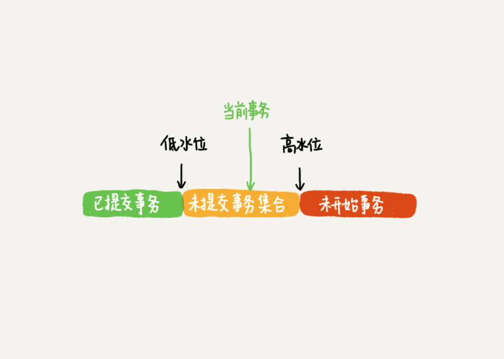

## Mysql

### 一、Mysql基础

#### 1、mysql的查询语句
* Mysql分为server层和存储引擎层，具体可以参考下图:

  

* server层主要负责连接、查询缓存、分析器、优化器、执行器等，包含内置函数，夸引擎功能，存储过程、触发器、视图等
* 存储引擎是插件式，支持InnoDB、MyISAM、Memory等存储引擎
* 5.5.5以后的默认存储引擎是InnoDB
* 连接-->查询缓存-->分析器-->优化器-->执行器
* 连接：连接到mysql的server，权限校验，后续的所有校验结果都是以刚开始连接拿到的权限来的，如果中途改掉了，不会立即生效
* 查询缓存：查询是先查缓存中有没有数据，有就不用再接下来执行了，直接返回
* 分析器：查询缓存中没有要求的数据，那么走到分析器这里，分析器进行词法和语法分析，判断语句是否合法
* 优化器：对查询进行优化，索引该用哪个，多表关联怎么决定表的链接顺序
* 执行器：通过执行器执行语句获得结果，首先会判断自己的权限，然后再返回结果

#### 2、mysql的更新语句
* redo log 
	* redo log记录了操作的日志 
	* wal技术。 Write Ahead logging。当有更新操作的时候，不会直接更新记录，而是将记录先存到redo log
	* 当有更新来的时候，先把操作写入redo log，然后再将内存更新，这时候就认为内存更新成功了
	* redo log的大小有限制，同时存储redo log的是一个类似ring buffer。当其使用完后，会重新从开头进行写入，也就是说redo log中的日志会被覆盖掉。
	* redo log可以保证数据库崩溃恢复的时候，数据不丢失。
	
* binlog
	* 是数据库的归档日志，不会复写，会一直追加
	* redo log是InnoDB独有的而binlog是mysql-server中实现的，所有的存储引擎都是共享的
	* redo log是物理日志，存储的是数据页的变化，而binlog记录的是逻辑变更日志，存储的语句的原始逻辑
	
因此，一个update语句的执行逻辑就如下图所示：


* 两阶段提交
	* 为了让两份日志之间的逻辑一致
	* redo log和binlog都可能存在不立即持久化到磁盘的问题，这个涉及到MySQL的一个配置
	* innodb_flush_log_at_trx_commit，这个参数设置为1可以保证每次事务的redo log都持久化到磁盘
	* sync_binlog，这个参数设置为1可以保证每次事务的binlog都持久化到磁盘

#### 3、事务隔离
* 事务ACID：
	* Atomicity，原子性。一个事务所有的操作必须在一个逻辑结构中完成
	* Consistency，一致性。事务前后必须保持一致，为更新的不能发生变更
	* Isolation，隔离性。不同事务之间应该是不能互相影响的
	* Durability，持久性。事务提交执行，其变更应该是永久的。

* 事务隔离级别：
	* 读未提交。一个事务还没提交，其内部做的变更就可以被其他事务看到。级别最低的事务隔离
	* 读提交，一个事物提交之后，他所作的变更才能被其他事务看到。
	* 可重复度，一个事物执行过程中看到的数据，总是跟事务开始时看到的数据是一致的
	* 串行化，当出现读写锁冲突的时候，后面访问的事务必须等待前一个事务执行完成才能继续。

* 事务启动方式：
	* 显示启动，begin或者start transaction，同时配套使用commit或者回滚rollback。
	* autocommit=0，select语句就会启动事务，同时不会自动提交，这个事务会存在直到主动提交commit或者rollback。容易造成长事务。

#### 4、索引
（1）索引常见模型

* hashtable。
	* 以kv结构存储数据。
	* hash表这种结构适合于等值查询的场景，如果是范围查询，那么有序数组将会有更好的性能表现
	* 区间索引的查询很慢，一般会范围全扫，比较耗时
* 有序数组
	* 适用于静态存储索引，不太会变化的数据
	* 有序数组的更新操作成本很高
* 搜索树
	* 二叉树，搜索效率最高，有序，时间复杂度为O(log(N))，二叉树写入磁盘会有性能瓶颈，所以一般使用N叉树。
	
* InnoDB的索引模型
	* InnoDB中标都是根据主键顺序以索引的形式存放的，这就是索引组织表
	* 每个索引在InnoDB中对应的是一颗B+树
	* 主键索引为聚簇索引，其他索引为二级索引
	* 基于主键的序偶因最多只需要扫描一颗索引树即可，而其他索引需要先根据二级索引找到主键的值，然后根据主键索引再去查找数据。二级索引会有一个回表操作。应该尽量使用主键索引
	* B+树插入的时候会进行索引维护，会有页分裂或者页合并

* 覆盖索引
	* 如果索引返回的结果直接满足返回需要，就直接返回结果而不需要回表
	* 覆盖索引也通常是一种常用的性能优化手段

* 最左索引
	* 在创建联合索引的时候，应该以尽量提高索引的复用能力来安排索引内部的字段顺序
	* 如果可以通过调整顺序可以减少维护一个索引，那么这个顺序往往就是需要优先考虑采用的

* 索引下推
	* mysql在5.6中引入的索引下推优化，可以再索引遍历过程中，对索引中包含的字段先做判断，直接过滤掉不满足条件的记录，减少回表次数

	
#### 5、锁
* 锁分类
	* 全局锁。对整个数据库实例加锁，典型使用场景是对全库做逻辑备份
	* 表级锁。
		* 表锁。lock tables ... read/write。表锁除了限制其他线程的读写意外，也会限定本线程接下来的操作对象。例如，如果使用lock tables t1 read, t2 write。那么在该线程接下来的处理过程中，除了显示的unlock tables意外，该线程接下来对t1的访问权限只能是read，对t2的方位权限只能是write。
		* 元数据锁。不需要显式使用，在每次访问一个表的时候就会被自动加上，这样可以保证读写的正确性。
			* 给小表加一个字段或者修改一个字段，或者增加索引。这些操作都会用到数据库的元数据锁即MDL锁。
			* 元数据锁的获取，读锁和读锁之间是不竞争的，而获取写锁需要等读锁释放，同时获取读锁的时候，也需要写锁释放。不然小表容易造成死锁。
			* 给小表加字段，一方面可以给请求加超时时间，另一方面要减小长事务出现的概率
	* 行级锁 
		* 行级锁是由各个存储引擎自己实现的，并不是所有的存储引擎都支持行锁
		* InnoDB中，行锁是在需要的时候才去请求持有，但并不是不需要了就释放掉，而是要等待事务结束才释放，这就是两阶段锁协议。
		* 在事务中，如果需要锁多个行，那么必须把最有可能造成锁冲突，最有可能影响并发度的锁尽量往后放。
		* 死锁
			* 循环资源依赖
			* 死锁解决一是增加等待超时时间
			* 二是发起死锁检查，主动回滚其中某一条事务

#### 6、事务隔离和可见性
* InnoDB可重复读隔离级别
	* 事务启动并不是begin或者start transaction而是执行到他的第一个操作的语句，事务才真正开始执行。如果希望一开始就执行，那么需要使用start transaction with consistent snapshot这个命令
	* 第一种启动方式，事务的一致性视图是在第一个快照语句时创建
	* 第二种启动方式，一致性视图是在执行start transaction with consistent snapshot的时候创建

* 视图
	* 普通视图。逻辑视图，用查询语句定义的虚拟表，创建语法为create view，查询方法和其他方法一样
	* 一致性视图。InnoDB在实现mvcc的时候用到的视图，用来支持读提交和可重复读隔离级别的实现

* MVCC？
	* 可重复读隔离级别下，事务启动时创建一个快照，同时这个快照是基于整库级别的，那么怎么去保证整库级别的快照呢？
	* InnoDB中每个事务有一个事务id，为transaction id。他是在事务开始时向事务系统发起请求的，当这个id用完以后会重新从0开始，就有可能出现脏读的bug。这个id是按照申请的顺序严格递增的。
	* 每行数据也有多个版本，每次更新数据的时候都会生成新的数据版本，并且把transaction id赋予这个数据版本的事务id，这里的id记为row trx_id。就版本数据好保留。
	* 按照可重复读隔离级别，一个事务启动时能看到所有已经提交的事务结果，但是事务执行期间，其他事务的更新对他不可见
	* InnoDB为每个事务构造了一个数组，用来保存这个事务启动瞬间，当前正“活跃”的事务的id。这里只启动，但是还未提交的事务。
	* 数组里记录的事务id的最小值是低水位，当前系统已经创建的事务id的最大值加一为高水位。这个高低水位就构成了一致性视图的基础。数据版本的可见性规则就是根据row trx_id和这个一致性视图对比得到的
	数据版本的可见性规则如下图所示：
	
	
	
* 落在绿色区域的部分，表示这个版本是已经提交的事务或者当前事务自己生成的，这个数据是可见的
* 落在红色部分，表示这个版本的数据有当前事务自己生成的，这个数据肯定是不可见的
* 落在黄色区域，一是如果在row trx_id的数组内部，就表示这个版本是由还没提交的事务生成的，不可见；二是如果不在row trx_id的数组中，表示这个版本是已经提交的事务生成的，可见。
* InnoDB保证事务启动前所有还没提交的事务都不可变，因此只存一个已提交事务的最大值是不够的，因为比最大值小的事务也有可能在之后更新，所以事务在启动的时候还要保存“现在正在执行的所有事务ID列表”，如果一个row trx_id在这个列表中，那么也必须保证不可见。


### 二、Mysql实践

####（1）唯一索引和普通索引的选择

* 唯一索引不能使用change buffer，唯一索引找到满足条件的语句后就不会再查找，普通索引会继续查找
* 普通索引加change buffer可能提升系统性能，redo-log节省磁盘随机写造成的性能影响，而change buffer主要节省随机读造成的io消耗
* 只有普通索引可以使用changebuffer，在使用changebuffer的时候，对于更新，如果数据页在内存中，那么久先更新内存，然后返回，如果数据页不在内存中，那么就将更新操作写入到changebuffer中，然后返回。当需要查询数据页的时候，如果数据页不在内存中，就从磁盘中读取数据页，然后执行跟当前数据页相关的操作，从而保证数据的一致性。
* changebuffer主要是为了缓解随机读的开销，而redolog只要是节省随机写的开销，将随机写转成顺序写。
* 当数据页在内存中不存在的时候，对于唯一索引，他会把数据页加载进内存中，然后判断是否满足唯一性要求，而对于普通索引，其将操作写入changebuffer，然后直接返回，少了一步数据页加载的过程。


####（2）Mysql为什么会选错索引

* 优化器的逻辑：
	* 扫描行数的判读，统计信息判断，如果统计信息不准确，那么有可能会造成优化器判断失误，造成选错索引
	* 1、可以通过force index强制指定索引
	* 2、通过修改mysql语句，引导mysql选择正确的索引
	* 3、创建合适的索引

####（3）字符串加索引

* mysql支持前缀索引，当然前缀索引可能造成查询扫描的数据量增加
* 合理的前缀索引可以节省空间，同时加快查询速度
* 使用前缀索引就没法使用覆盖索引带来的优化效果了
* 可以使用倒叙索引
* 使用hash字段

####（4）数据库为什么会抖一下？

* 刷脏页，将内存中的数据刷入磁盘永久保存
* 什么情况下会刷脏页呢？
	* redo-log写满了
	* 系统内存不足，需要淘汰脏页，这些淘汰的脏页就被刷进内存
	* mysql认为系统空闲的时候，也就主动进行刷脏页的动作
	* mysql正常关闭的时候需要把内存中的脏页刷入到磁盘中

####（5）数据删了一半，文件大小确没变

* 数据页的重用造成的
* 删除数据、插入数据都可能造成数据页空洞
* 解决？重建表

####（6）count(*)太慢？

* 全表扫描
* InnoDB没法存储行数据
* 解决方式：
	* 缓存计数保存
	* 数据库保存计数

####（7）order by怎么工作的

* sort buffer。查询数据，放到sort buffer缓存
* 如果buffer放不下，分段缓存合并
* 如果单行数据太大，可以只排序需要的字段列和主键字段
* rowid排序

####（8）如果现实随机数据

* 如果表没有主键id，那么InnoDB会自动创建rowid作为主键
* order by rand() 使用了内存临时表，内存临时表排序的时候使用了 rowid 排序方法。
* 解决？修改sql，通过计算随机位置以后再去查找数据。

``` sql
	select count(*) into @C from t;
	set @Y1 = floor(@C * rand());
	set @Y2 = floor(@C * rand());
	set @Y3 = floor(@C * rand());
	select * from t limit @Y1, 1; /*在应用代码里面取Y1、Y2、Y3值，拼出SQL后执行*/
	select * from t limit @Y2, 1;
	select * from t limit @Y3, 1;
```

####（9）为啥逻辑相同，但是性能差距很大？

* 对索引字段做的函数操作会破坏原有的字段的有序性，会让优化器放弃使用索引
* 隐式类型转换也是函数操作，也会有这样的问题
* 隐式字符转换
* 连接过程中要求在被驱动表的索引字段上加函数操作，是直接导致对被驱动表做全表扫描的原因

####（10）为什么执行一行也很慢？

* 长时间不返回，表被锁住了
* 等MDL锁，一个线程正在表t上请求或持有MSL锁，从而把select语句阻塞住了
* 等flush，flush单表或者flush全表
* 等行锁
* 慢查询，执行了全表扫描

####（11）mysql怎么保证数据不丢失，崩溃恢复

* binlog写入
* redo-log写入

####（12）查询大量数据会不会把数据库打爆

* 不会，结果集会存在netbuffer中，而net buffer是有大小限制的，而且不是一次性存取然后写入，是获取一部分就返回一部分
* 全表扫描可能会影响缓存命中率

####（13）mysql的join

* 选择合适的驱动表
* 如果join_buffer放不下，那就分段放入
* 尽量使用小表做驱动表
* 优化join：
	* 如果按照主键的递增顺序查询的话，对磁盘的读比较接近顺序读，能够提升读性能
	
####（14）自增主键为什么不连续

####（15）insert语句锁为什么这么多

####（16）怎么样快速复制一个表

####（17）自增id用完了怎么办？


